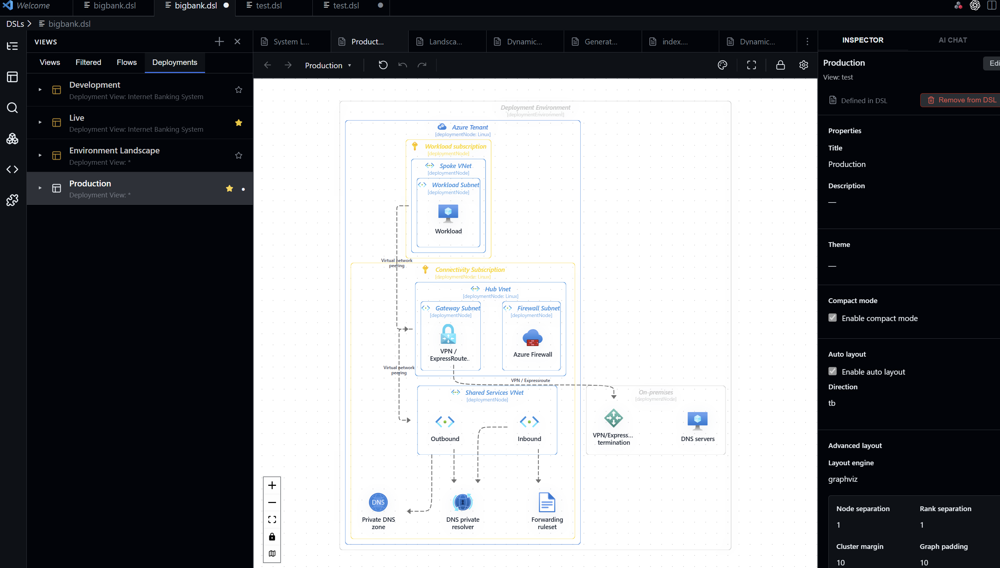

# ArchTect

**ArchTect** is a visual editor for Structurizr DSL inside VS Code. Edit architecture as code and as diagrams — with a bidirectional canvas ↔ DSL workflow that keeps both in sync — and generate architecture documentation directly from your model.

## 🎥 2-Minute Overview

---

## Documentation

Full documentation is at **https://archstudio.io/**

Covers:
- Getting started with the VS Code extension
- UI reference (canvas, toolbar, inspector)
- All view types with DSL examples
- Generating architecture documentation
- DSL support matrix and command reference

---

## Report an issue or request a feature

Use [GitHub Issues](https://github.com/nicobit/ArchTect/issues) to:
- Report a bug
- Request a feature
- Ask a question

Please use the provided templates so reports include the information needed to act on them quickly.
