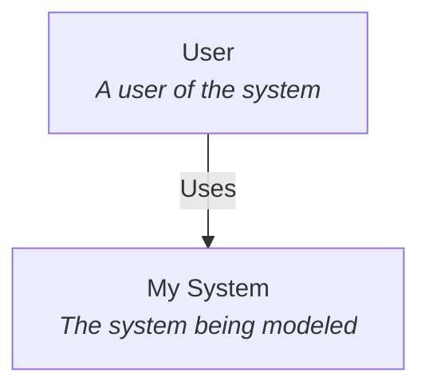
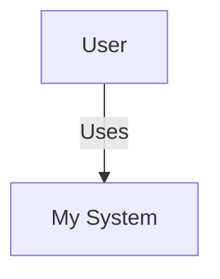

Export your architecture views as [Mermaid](https://mermaid.js.org/) diagram code — a text-based diagramming syntax supported by GitHub, GitLab, Notion, and many Markdown renderers.

## Why Mermaid

- **Embeds in Markdown** — Paste directly into GitHub READMEs, pull request descriptions, wikis, and Markdown documentation.
- **Renders automatically** — GitHub, GitLab, Notion, and other platforms render Mermaid blocks into diagrams without any plugin.
- **Version-control friendly** — Text-based output diffs cleanly in git.

## How to export

1. Open the view you want to export.
2. Click **Export → Mermaid** in the toolbar.
3. The Mermaid code is generated and available for download or copy.

## Example output

A system context view might export as:

~~~markdown

~~~

## Usage

Paste the output into any Markdown file:

~~~markdown
## Architecture

~~~

The diagram renders automatically in GitHub, GitLab, Azure DevOps, Notion, and other Mermaid-compatible platforms.

<Note>
**Limitations**

Mermaid has its own styling and layout engine. The exported diagram may look different from the ArchTect canvas — colors, positions, and shapes are adapted to Mermaid's capabilities.
</Note>

## See also

- [PlantUML](/export/plantuml) — Alternative text-based export
- [PNG and SVG](/export/images) — Image export for exact visual fidelity
- [Export overview](/export) — All export formats
