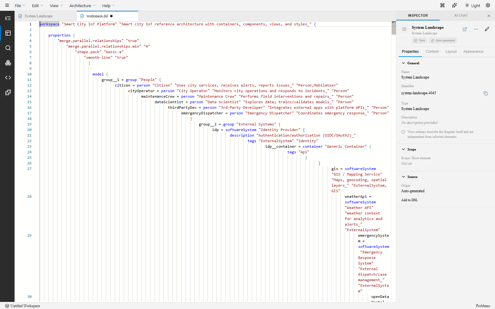
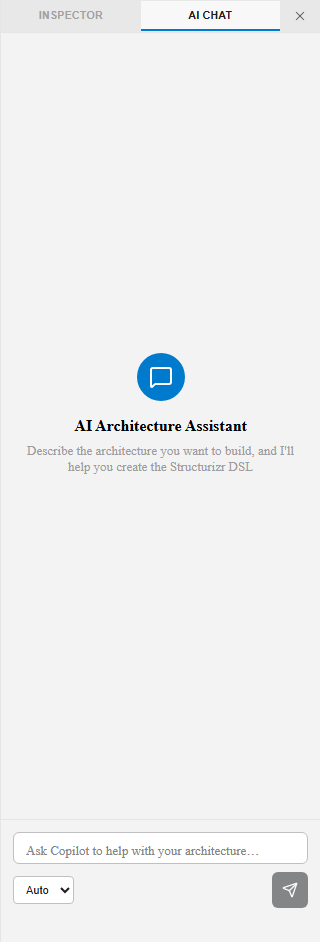

## The problem with architecture documentation

Most teams struggle with a painful choice: use **code-based tools** (like PlantUML) that are precise but hard to communicate with, or use **visual tools** (like draw.io) that look great but can't be version-controlled or validated. Either way, architecture diagrams drift from reality, reviews become unreliable, and documentation rots.

## ArchTect bridges both worlds

ArchTect gives you the **precision of a DSL** and the **clarity of a visual editor** — without compromise.

### Code-first clarity, visual-first communication

Bidirectional canvas-to-DSL editing keeps the diagram and model in permanent sync. Edit in whichever surface is most productive — the DSL editor or the interactive canvas, open as tabs side by side — without losing fidelity. Every visual change serializes back to clean, deterministic DSL.

### Built for both architects and engineers

- **Architects** get interactive diagrams, multiple view types, and executive-ready exports (PNG, SVG, Mermaid, PlantUML, Ilograph).
- **Engineers** get a version-controllable DSL, stable view keys, and a VS Code extension that fits into their existing workflow.
- **Reviewers** get deterministic outputs they can trust — same model in, same diagram out.

### Consistency and governance

ArchTect is deterministic by design. Serialization is stable and layouts are predictable. View types are explicit, with stable view keys, so architecture reviews are repeatable and governance-ready. No more "it looked different on my machine."

### AI-assisted modeling

Built-in AI chat and VS Code Copilot integration help you iterate faster. Get suggestions for modeling decisions, generate arc42 documentation from your model, and explore your architecture through natural language.

### Enterprise-friendly outputs

Export diagrams to PNG, SVG, Mermaid, PlantUML, or Ilograph. Generate arc42-structured documentation directly from your model. Share architecture with stakeholders in whatever format they need.

### VS Code native

ArchTect runs as a VS Code extension — no separate app to install, no context switching. Open `.dsl` files directly, use the Command Palette, and leverage the Copilot chat participant. It also runs as a standalone browser app for teams that prefer web-based access.

## How ArchTect compares

| Capability | Code-only tools | Visual-only tools | **ArchTect** |
|---|---|---|---|
| DSL / text-based modeling | Yes | No | **Yes** |
| Version-control friendly | Yes | Difficult | **Yes** |
| Interactive visual editor | No | Yes | **Yes** |
| Bidirectional DSL ↔ canvas | No | No | **Yes** |
| Deterministic outputs | Varies | No | **Yes** |
| AI-assisted modeling | No | No | **Yes** |
| arc42 doc generation | No | No | **Yes** |
| Multi-format export | Limited | Image only | **PNG, SVG, Mermaid, PlantUML, Ilograph** |
| VS Code integration | Partial | No | **Native extension** |
